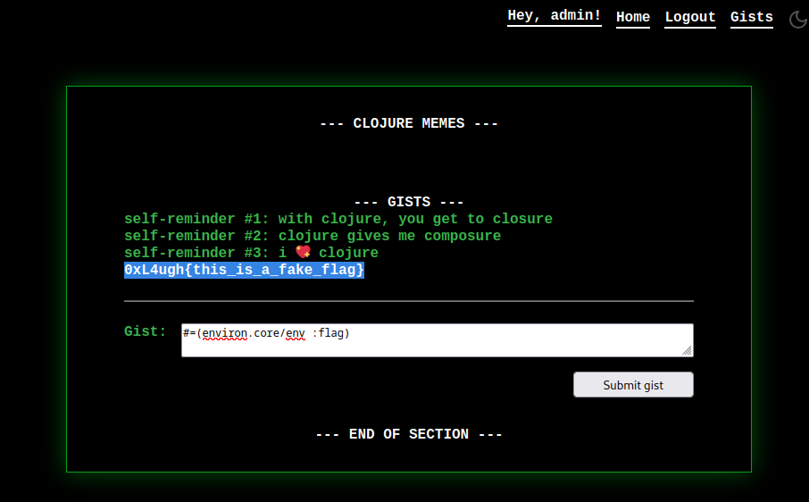

# 0xL4ugh CTF 2024 - Write-Up 

## Web Challenge : Manifesto

## Source code analysis
```clojure
(defn routes [{:keys [request-method uri session query-params form-params]}]
  (cond
    ;; index route
    (re-matches #"/" uri)
    (-> (r/response
         (render-file "index.html"
                      {:prefer (or (query-params "prefer") (session "prefer") "light")
                       :username (session "username")
                       :url uri}))
        (assoc :session (merge {"prefer" "light"} session query-params)))
    
    ;; display user gists, protected for now
    (re-matches #"/gists" uri)
    (cond (not= (session "username") "admin")
          (json-response {:error "You do not have enough privileges"})

          (= request-method :get)
          (r/response
           (render-file "gists.html"
                        {:prefer (session "prefer")
                         :username (session "username")
                         :gists (get-in @users [(session "username") :gists])
                         :url uri}))

          (= request-method :post)
          (let [{:strs [gist]} form-params]
            (try
              (insert-gist (session "username") (read-string gist))
              (r/redirect "/gists")
              (catch Exception _ (json-response {:error "Something went wrong..."}))))

          :else
          (json-response {:error "Something went wrong..."}))
    
    ;; login route
    (re-matches #"/login" uri)
    (cond
      (session "username")
      (r/redirect "/")
      
      (= request-method :get)
      (r/response
       (render-file "login.html"
                    {:prefer (session "prefer")
                     :user (@users (session "username"))
                     :url uri}))
      (= request-method :post)
      (let [{:strs [username password]} form-params]
        (cond
          (empty? (remove empty? [username password]))
          (json-response
           {:error "Missing fields"
            :fields (filter #(empty? (form-params %)) ["username" "password"])})
          :else
          ;; get user by username
          (let [user (@users username)]
            ;; check password
            (if (and user (= password (:password user)))
              ;; login
              (-> (r/redirect "/gists")
                  (assoc :session
                         (merge session {"username" username})))
              ;; invalid username or password
              (json-response {:error "Invalid username or password"})))))
    
    ;; logout route
    (re-matches #"/logout" uri)
    (-> (r/redirect "/") (assoc :session {}))

    ;; catch all
    :else
    (-> (r/response "404 Not Found")
        (r/status 404))))
```

### 1. **Broken Access Control**

  - The application includes a `/gists` route, which should only be accessible to the `admin` user.

  - The authentication check is bypassed using the `prefer` query parameter. The application doesn't verify whether the user accessing the page is truly the `admin`. Instead, it checks if a `username` session variable is present, but this session isn't properly validated.

  - The query parameter `prefer` determines the theme (`light` or `dark`) for the interface which can be exploited to bypass admin by manipulating the query parameters to set the username as `admin`.

  -The `/gists` route does not properly validate user session when redirect redirect through . Anyone with the correct parameters can access the gists without being the admin.

`?prefer=dark&username=admin&redirect=/gists`
This will bypass the authentication check and load the gists page as the admin user.
---

### 2. **Server-Side Template Injection (SSTI)**

```clojure
(ns manifesto.core
  (:require [clojure.java.io :as io]
            [clojure.core :refer [str read-string]]
            [ring.adapter.jetty :refer [run-jetty]]
            [ring.util.response :as r]
            [ring.middleware.resource :refer [wrap-resource]]
            [ring.middleware.params :refer [wrap-params]]
            [ring.middleware.session :refer [wrap-session]]
            [selmer.parser :refer [render-file]]
            [cheshire.core :as json]
            [environ.core :refer [env]]))

;; thread-safe stores powered by clojure atoms
(defonce server (atom nil))
(def users (atom {}))
.
.
.
.

           (= request-method :post)
           (let [{:strs [gist]} form-params]
             ;; clojure has excellent error handling capabilities
             (try
               (insert-gist (session "username") (read-string gist))
               (r/redirect "/gists")
               (catch Exception _ (json-response {:error "Something went wrong..."}))))

           :else
           (json-response {:error "Something went wrong..."}))
.
.
.
.
```

- The flag is stored as an environment variable (`FLAG`) on the server, and the app uses `environ.core/env` to access the environment variables.

- `gists` directly renders user input without sanitization.
- Inject this payload in gists `#=(environ.core/env :flag)` to retrieve the `FLAG` from the env.

  


